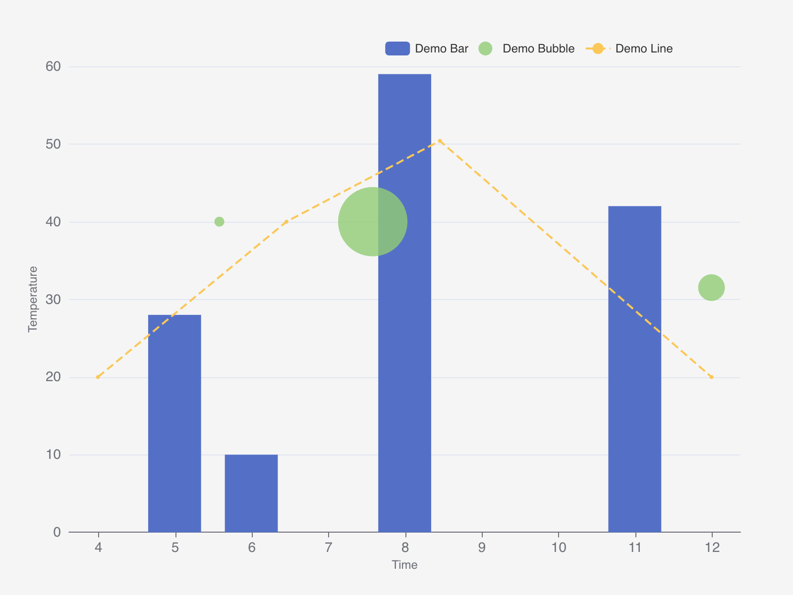

# \<widget-linechart>

A Lit 3.x web component for rendering interactive line, bar, and scatter charts using ECharts. Part of the IronFlock widget ecosystem.



## Installation

```bash
npm i @record-evolution/widget-linechart
```

## Usage

### Bundled Application (Vite/Webpack)

When using a bundler, install the widget and its peer dependencies:

```bash
npm i @record-evolution/widget-linechart echarts@^6.0.0 tinycolor2@^1.6.0
```

Then import and use:

```html
<script type="module">
    import '@record-evolution/widget-linechart/widget-linechart.js'
</script>

<widget-linechart-1.6.28></widget-linechart-1.6.28>
```

The bundler will automatically deduplicate echarts across multiple widgets.

### CDN / Import Maps

For CDN usage without a bundler, configure an import map with all dependencies:

```html
<script>
    // Polyfill for Node.js process.env required by echarts
    window.process = { env: { NODE_ENV: 'production' } }
</script>

<script type="importmap">
    {
        "imports": {
            "echarts/core": "https://cdn.jsdelivr.net/npm/echarts@6.0.0/core.js",
            "echarts/charts": "https://cdn.jsdelivr.net/npm/echarts@6.0.0/charts.js",
            "echarts/components": "https://cdn.jsdelivr.net/npm/echarts@6.0.0/components.js",
            "echarts/renderers": "https://cdn.jsdelivr.net/npm/echarts@6.0.0/renderers.js",
            "echarts/features": "https://cdn.jsdelivr.net/npm/echarts@6.0.0/features.js",
            "zrender/": "https://cdn.jsdelivr.net/npm/zrender@6.0.0/",
            "tslib": "https://cdn.jsdelivr.net/npm/tslib@2.8.1/tslib.es6.mjs",
            "tinycolor2": "https://cdn.jsdelivr.net/npm/tinycolor2@1.6.0/+esm"
        }
    }
</script>

<script
    type="module"
    src="https://cdn.jsdelivr.net/npm/@record-evolution/widget-linechart@1.6.28/dist/widget-linechart.js"
></script>

<widget-linechart-1.6.28></widget-linechart-1.6.28>
```

**Note:** Version matching is critical - echarts 6.0.0 requires zrender 6.0.0 exactly.

## Dependencies

This widget has been optimized to externalize heavy dependencies:

- **echarts** (^6.0.0) - Chart rendering engine (~300KB)
- **tinycolor2** (^1.6.0) - Color manipulation utilities

Bundle size: ~36KB (down from 625KB with bundled echarts)

## Configuration

The widget accepts an `inputData` property with the following structure:

### Axis Configuration (`axis`)

| Option         | Type    | Default | Description                                               |
| -------------- | ------- | ------- | --------------------------------------------------------- |
| `showLegend`   | boolean | `true`  | Display the chart legend                                  |
| `showTitle`    | boolean | `true`  | Display the chart title                                   |
| `showBox`      | boolean | `false` | Display a border frame around the chart area              |
| `timeseries`   | boolean | `false` | Enable time series x-axis (x-values should be timestamps) |
| `columnLayout` | boolean | `false` | Stack multiple charts vertically instead of horizontally  |
| `xAxisLabel`   | string  | -       | Label for the x-axis                                      |
| `showXAxis`    | boolean | `true`  | Show/hide x-axis and labels                               |
| `xAxisZoom`    | boolean | `false` | Enable zoom tool on x-axis                                |
| `yAxisLabel`   | string  | -       | Label for the y-axis (positioned at top)                  |
| `showYAxis`    | boolean | `true`  | Show/hide y-axis and labels                               |
| `yAxisScaling` | boolean | `false` | Scale y-axis to data range (otherwise starts at 0)        |

### Data Series (`dataseries[]`)

| Option                | Type                               | Description                                                   |
| --------------------- | ---------------------------------- | ------------------------------------------------------------- |
| `label`               | string                             | Series name shown in legend                                   |
| `type`                | `"line"` \| `"bar"` \| `"scatter"` | Chart type for this series                                    |
| `data`                | array                              | Array of `{ x, y, r?, pivot? }` data points                   |
| `backgroundColor`     | color                              | Fill color for area/bars                                      |
| `borderColor`         | color                              | Line/border color                                             |
| `styling.borderWidth` | number                             | Line width (default: 2)                                       |
| `styling.borderDash`  | string                             | Line style: `"solid"`, `"dashed"`, `"dotted"`                 |
| `styling.fill`        | boolean                            | Fill area under line                                          |
| `styling.pointStyle`  | string                             | Point shape: `"circle"`, `"rect"`, `"triangle"`, `"none"`     |
| `advanced.chartName`  | string                             | Group series into named charts; use `#split#` for auto-naming |
| `advanced.drawOrder`  | number                             | Z-index for layering series                                   |

## Expected Data Format

See [src/default-data.json](src/default-data.json) for a complete example.

## Features

- **Chart types:** line, bar, scatter (via `dataseries[].type`)
- **Time series:** Set `axis.timeseries: true` for date-based x-axis
- **Multi-chart:** Use `advanced.chartName` to split series into separate charts
- **Pivot/Split:** `data[].pivot` auto-generates series per distinct value
- **Adaptive animation:** Animation duration automatically matches data update frequency
- **Dynamic theming:** Supports ECharts theme objects via the `theme` property
- **Visibility controls:** Toggle legend, title, axes, and box frame independently
- **Y-axis label:** Positioned at top of axis to avoid overlap with tick labels

## Performance Optimizations

- Efficient data-only updates using `setOption()` merge mode
- Full rebuild only on configuration changes (detected via config fingerprinting)
- ResizeObserver-based chart resizing (no polling)
- Adaptive animation timing based on actual update intervals

## Local Demo

```bash
npm start
```

Runs a development server at http://localhost:8000/demo/
